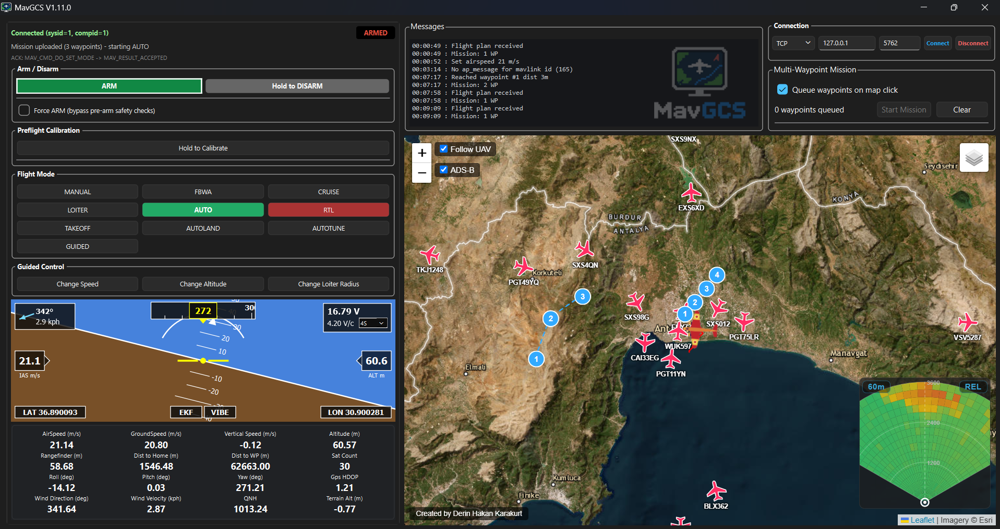

# MavGCS

A ground control station software for MAVLink protocol.

It works with Ardupilot, PX4 (Bi-directional) or iNav (Uni-directional).

Supports RFD or similar telemetry radios or MAVLink over ELRS.

You can monitor HUD and vital information about flight, see the vehicle and ADS-B data on the moving map, view terrain radar, execute instant waypoint missions and more.

Created by Derin Hakan Karakurt

## Download (Windows)

Grab `MavGCS-<version>-windows.zip` from the
[Releases page](https://github.com/kolabuzlu/MavGCS/releases), extract it,
and run **MavGCS.exe**. No setup needed.
