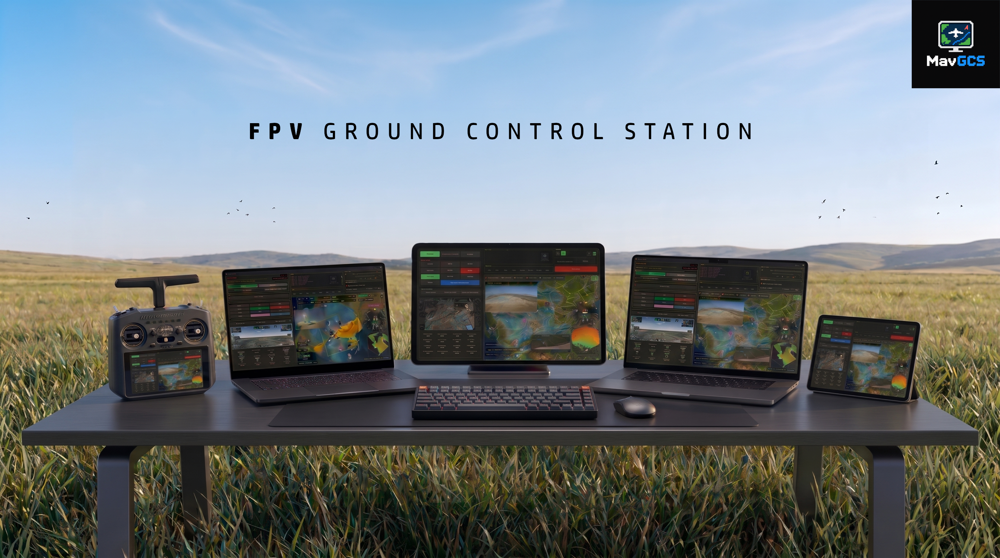

## 
Ground Control Station for ArduPilot & PX4, INAV.

 
 
 
 

A ground control station software for **MAVLink** protocol. 🛩️

It works with **Ardupilot**, **PX4** (Bi-directional) or **INAV** (Uni-directional).

Supports RFD and similar telemetry radios, MAVLink over ELRS and LTE telemetry.

You can monitor HUD and vital information about flight, use weather radar, experience 3D FPV view, watch live video feed, see the vehicle and ADS-B traffic data on the moving map, view terrain radar, execute instant waypoint missions, evaluate flight statistics and more.

You need to get free token from [ion.cesium.com](http://ion.cesium.com/) to activate 3D FPV view.

There is an Android version too: [MavGCS Android](https://github.com/kolabuzlu/MavGCS-Android).

Created by **Derin Hakan Karakurt**

### Installing & Running MavGCS 💻

**Windows** - download `MavGCS-<version>-windows.zip` from the
[Releases page](https://github.com/kolabuzlu/MavGCS/releases), extract it, and run **MavGCS.exe**. No setup needed.

**macOS** - download `MavGCS-<version>-macos-x86_64.zip` from the same
page and drag **MavGCS.app** to Applications. The app is unsigned, so the
first launch needs one command to clear the download quarantine - macOS
reports an unsigned app as "damaged", which it is not. See
[INSTALL.md](INSTALL.md).

This is an Intel build: native on Intel Macs, and on Apple Silicon it
runs through Rosetta, which macOS offers to install the first time.
