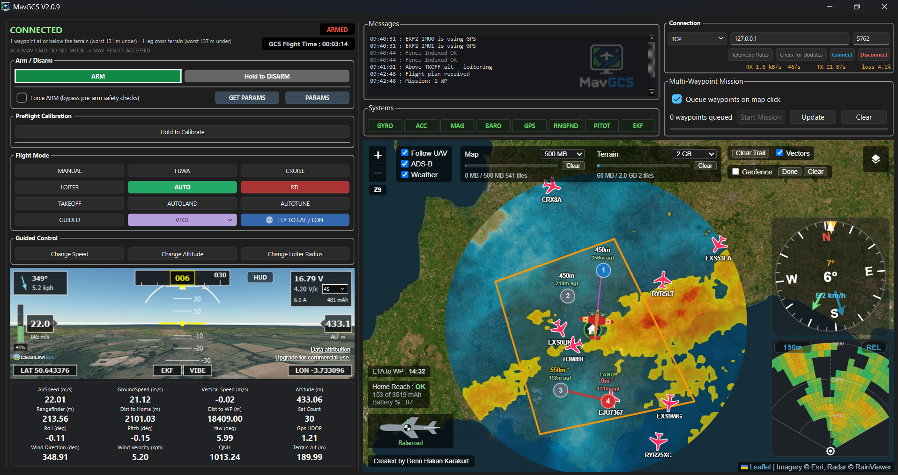

## 

## Ground Control Station for MAVLink

A ground control station software for MAVLink protocol. 🛩️

It works with Ardupilot, PX4 (Bi-directional) or iNav (Uni-directional).

Supports RFD or similar telemetry radios or MAVLink over ELRS.

You can monitor HUD and vital information about flight, use weather radar, experience 3D FPV view, see the vehicle and ADS-B traffic data on the moving map, view terrain radar, execute instant waypoint missions, evaluate flight statistics and more.

You need to get free token from [ion.cesium.com](http://ion.cesium.com/) to activate 3D FPV view.

Created by **Derin Hakan Karakurt**

### Installing & Running MavGCS (Windows) 💻

Download `MavGCS-<version>-windows.zip` from the
[Releases page](https://github.com/kolabuzlu/MavGCS/releases), extract it,
and run **MavGCS.exe**. No setup needed.

Dedicated to N.A. :sparkling_heart:
